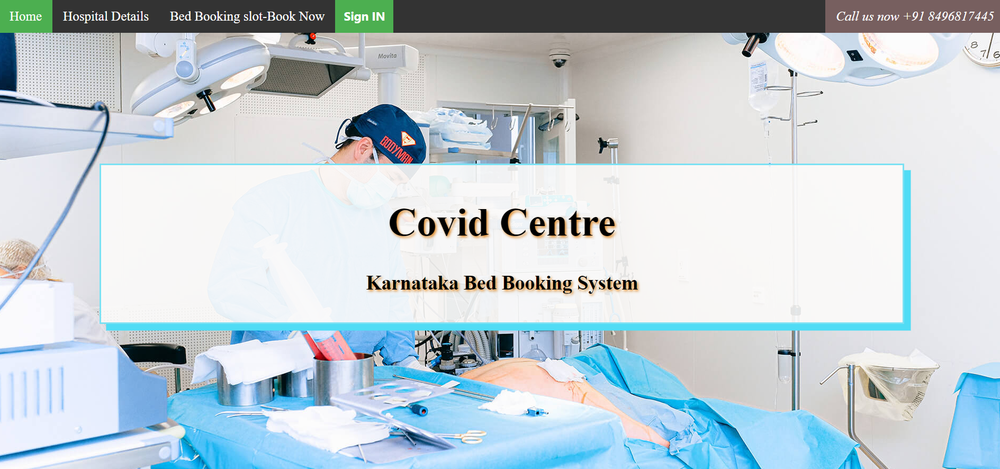

<h1 align="center">Covid Bed Slot Booking System</h1>


The project Covid Bed Slot Booking System includes registration of patients, storing their details into the system, and also computerized billing for beds in the hospitals. 

The software has the facility to give a unique id(SRFID) for every patient and stores the details of every patient automatically. It includes a facility to know the current status of availability of beds at each listed hospital.

This is a system that will manage information about list of various hospitals, availability of beds in hospitals, allotment of beds for patients and display patient details

## 🖥️ Tech Stack

**Frontend:**

- HTML5
- CSS3
- Javascript
- Bootstrap

**Backend:**

- Php

**DataBase:**

- mysql

## Understanding the functionalities of application

- The application have 3 types of users, **Admin**, **Hospital**, **Patient**.

- **Admin can -**

  - Register hospitals to database
  - View the triggered events

- **Hospitals can -**

  - View patient bookings for their hospital
  - Add / Edit / Delete hospital data

- **Patient can -**

  - View available beds
  - View their patient details and booking details
  - Book a bed

#### ``` Home Page ```



## Author

<b>👤 Srichandan</b>

- LinkedIn - [@Srichandan](https://www.linkedin.com/in/srichandan09)
- Github: [@Srichandan-09](https://github.com/Srichandan-09)

Feel free to contact me with any questions or feedback!

## Show your support

Give a ⭐️ if you liked this project!
